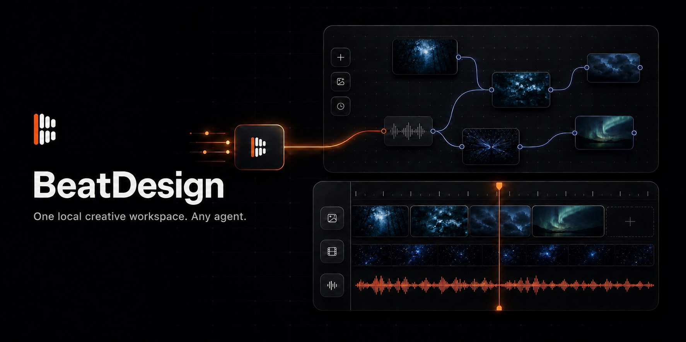

<p align="center">
  
</p>

<h1 align="center">BeatDesign</h1>

<p align="center">
  <strong>一个本地创作工作台，连接任意 Agent。</strong><br />
  在 Canvas 上生成，在时间线上编辑，让支持 MCP 的 Agent 在旁边操控同一个项目。
</p>

<p align="center">
  <a href="#快速开始">快速开始</a> ·
  <a href="#通过-mcp-让-agent-操控">MCP</a> ·
  <a href="./docs/PRODUCT_PLAN_AND_STATUS.md">产品状态</a> ·
  <a href="./README.md">English</a>
</p>

BeatDesign 是一个免费、开源、本地优先的 AI 媒体工作台。它把引导式 Studio、无限 Canvas、短视频 Editor 和共享 Asset 素材库放进同一个本地 Project。

浏览器是用户可见的创作空间。Codex、Claude Code、Cursor 或其他支持 MCP 的 Agent，可以通过 BeatDesign 的 20 个本地工具读取和修改同一个 Project。通用编程 Agent 使用本地 stdio；千问办公和豆包办公可以使用本地 Streamable HTTP 连接器。本仓库不包含账号、订阅、本地积分账本、支付或管理后台。

## 连续创作闭环

```text
提示词或本地素材
        ↓
Studio / Canvas ── 生成、分支、连接、复用
        ↓
共享 Assets ───── 图片、视频、音频、截取片段、成片
        ↓
Editor ────────── 裁剪、切分、移动、混音、AI 重做、导出 MP4
        ↑
任意 MCP Agent ── 读取项目并执行项目级指令
```

它把原本分散在 AI 生成器、下载文件夹和剪辑软件里的步骤，收敛成一条连续工作流。

## 一个 Project，四个视图

| 视图 | 用途 |
| --- | --- |
| **Studio** | 用提示词完成图片/视频生成，以及 Standard / Deep 视频分析。 |
| **Canvas** | 组织媒体节点、生成历史、引用关系、分支与可复用输出。 |
| **Editor** | 在本地时间线上编辑视频、图片和音频，并导出 MP4。 |
| **Assets** | Studio、Canvas、Editor 和 MCP 共享的项目级素材事实层。 |

## BeatDesign 的核心区别

- **本地优先。** Project、Canvas 快照、时间线、生成历史和导入媒体都保存在本地工作区。
- **Agent 原生，但不绑定某个 Agent。** BeatDesign 暴露标准 stdio 和 Streamable HTTP MCP Server，而不是内置一个封闭聊天机器人。
- **Asset-first。** 生成和导入的媒体先成为稳定的 Project Asset，再进入 Canvas 或 Editor。
- **统一命令路径。** UI 与 MCP 写操作共用 Command Kernel、revision 检查和持久化 receipt。
- **不要求安装系统 FFmpeg。** 预览和 MP4 导出使用浏览器 WebCodecs 与 Mediabunny。
- **Provider 边界清楚。** BeatAPI 是默认内置生成适配器；fork 可以增加自己的适配器，不需要重写 Canvas 或 Editor。

## 快速开始

需要 Node.js 22+、pnpm 10+，以及 macOS 或 Windows 上的新版 Chrome。

```bash
pnpm install
pnpm db:push
pnpm dev
```

打开 [http://127.0.0.1:3020](http://127.0.0.1:3020)。

本地导入、Canvas 操作、时间线剪辑、预览和 MP4 导出都不需要 API Key。只有在生成、分析媒体或使用 AI 重做时，才需要填写自己的 [BeatAPI API Key](https://beatapi.io/dashboard/apikeys)。

## 通过 MCP 让 Agent 操控

BeatDesign 本地运行可视工作台，再选择一种 Agent 控制传输读取同一个 SQLite 数据库：

| 进程 | 命令 | 作用 |
| --- | --- | --- |
| 可视工作台 | `pnpm dev` | 在浏览器中打开 Studio、Canvas、Editor 和 Assets。 |
| Agent 控制面 | `pnpm --silent mcp` | 通过 stdio 暴露项目级工具。 |
| HTTP 连接器 | `pnpm --silent mcp:http` | 在 `127.0.0.1:3031` 暴露 `/mcp`，供千问办公和豆包办公使用。 |

编程 Agent 使用 stdio 控制面，办公连接器使用 HTTP 控制面；通常不需要同时运行两者。

仓库根目录已经包含兼容宿主可读取的 `.mcp.json`；Codex 的轻量启动封装位于 `integrations/codex/beatdesign`。

20 个工具按照稳定的产品概念分组：

- **Project（3）：** 列表、读取、创建。
- **Asset（3）：** 列表、读取、导入本地图片/视频/音频。
- **Canvas（3）：** 读取、搜索、增量修改。
- **Generation（5）：** 获取模型与参数、提交生成、刷新状态、读取历史。
- **Editor（6）：** 读取、编辑、语义快照、诊断、视图深链、命令历史。

MCP 不会模拟点击界面像素。Agent 读取 Project、提交稳定命令，BeatDesign 再从同一份本地状态刷新用户可见的 Canvas 或 Editor。

详细接入方式见 [MCP 设置与工具边界](./docs/MCP.md)。

## 当前已经支持

### Canvas 与生成

- 图片、视频、音频、时间线及文本向 Canvas 节点。
- 由一份代码目录统一定义的 BeatAPI 模型、参数与引用能力。
- Asset 引用、连接工作流、生成历史和本地持久化输出。
- 图片/视频生成，以及 Standard / Deep 视频分析。
- 通过共享 Asset 与时间线节点完成 Canvas-to-Editor 交接。

### 本地 Editor

- 视频、静态图片和音频共用一条时间线。
- 拖动裁剪、切分、移动、删除、波纹删除，以及静态图片时长调整。
- Undo/redo、播放、源素材范围选择、音量和淡入淡出。
- 把选中区间交给 AI 重做，并以非破坏性 Take 保存。
- 检查空隙、重叠、素材缺失、时长不一致和过短片段。
- 在浏览器中导出 H.264/AAC MP4；成片会回到 Project Assets。

### 本地持久化

- Project 数据保存在 `data/` 下的 SQLite。
- 项目媒体保存在 `data/project-assets/<project-id>/`。
- Canvas 与 Editor 使用 revision-aware 保存。
- 中英文界面。

## 数据与 Provider 边界

```text
浏览器 UI / MCP
      ↓
Command Kernel + Project services
      ↓
SQLite + data/project-assets
      ↓ 仅在用户确认生成后
Generation adapter（默认 BeatAPI）
      ↓
输出复制回本地 Asset 素材库
```

API Key 和可选的 R2/S3 凭据会加密保存在本地 SQLite。选择或拖入本地文件不会把它发送给 Provider；BeatDesign 会先把它持久化为本地 Project Asset，只有用户确认生成后，才上传该次生成真正需要的素材。默认使用 BeatAPI Files，用户也可以在“连接配置”中选择自己的公网 R2/S3 兼容存储桶。

BeatDesign 不重复实现 Provider 的余额、计费或限流逻辑，只把 Provider 的结果或错误返回给 UI / MCP。上游仓库内置官方 BeatAPI 适配器；fork 可以实现 `BaseAdapter`，并在 `src/config/generation-providers.ts` 中注册和选择。

完整约定见 [Provider 架构](./PROVIDERS.md) 与 [系统架构](./ARCHITECTURE.md)。

## v0.2 当前边界

BeatDesign v0.2 聚焦本地 AI 短视频工作流：

- 支持 macOS / Windows 上的新版 Chrome。
- 支持常见浏览器可解码图片、MP4/MOV 视频，以及 MP3/WAV/M4A/AAC/OGG 音频。
- 每个 Project 当前只有一条活动时间线；导出仍受浏览器内存约束。
- Canvas 和 Editor 每两秒轮询 Agent revision；暂未实现实时事件总线。
- Editor MCP snapshot 是语义检查，不是像素截图。
- 字幕、转场、变速、波形、多时间线和原生桌面封装仍属于后续阶段。

完整的已完成/待完成边界见 [产品规划与当前状态](./docs/PRODUCT_PLAN_AND_STATUS.md)。

## 开发命令

| 命令 | 作用 |
| --- | --- |
| `pnpm dev` | 在 `127.0.0.1:3020` 启动本地应用。 |
| `pnpm --silent mcp` | 通过 stdio 启动本地 MCP Server。 |
| `pnpm typecheck` | 检查 TypeScript 契约。 |
| `pnpm test` | 运行单元与契约测试。 |
| `pnpm i18n:check` | 校验中英文消息。 |
| `pnpm build` | 构建生产版本。 |
| `pnpm db:push` | 在本地开发中应用 SQLite schema。 |
| `pnpm media:localize` | 把旧 Project 快照中的 Provider 媒体复制到本地素材目录。 |

## 参与贡献

先阅读 [CONTRIBUTING.md](./CONTRIBUTING.md)，再按需查看：

- [ARCHITECTURE.md](./ARCHITECTURE.md)：系统边界。
- [WORKSPACE_MODES.md](./WORKSPACE_MODES.md)：产品视图。
- [docs/MCP.md](./docs/MCP.md)：Agent 接入。
- [DESIGN.md](./DESIGN.md)：BeatDesign 视觉语言。
- [SECURITY.md](./SECURITY.md)：本地工作区安全。

## License

BeatDesign 使用 [Apache License 2.0](./LICENSE)。许可证覆盖代码，不覆盖 BeatAPI 商标、服务访问、模型 Provider 权利或第三方素材。时间线契约派生自 MIT 许可的 OpenReel，浏览器媒体管线使用 MPL-2.0 Mediabunny；详见 [`third_party/`](./third_party) 与 [TRADEMARKS.md](./TRADEMARKS.md)。
